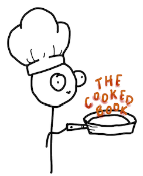

# **The Cooked Book**
Creators: Campbell Furr, Joshua J, Michelle Tra, Tyler Tran
## Introduction
We have created a functional website that helps users decide what to cook based on the ingredients they have. By inputting available ingredients, users will receive meal suggestions, making cooking more convenient and reducing food waste.  
MVP: Include the ability for users to input ingredients and receive relevant meal suggestions, with a simple user interface that supports recipe search, filtering for dietary restrictions, and basic recipe viewing. Admins will be able to upload, edit, and manage recipes, ensuring a functioning platform for both users and administrators.
