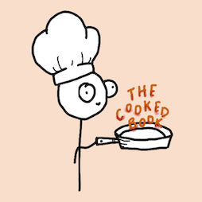

# **The Cooked Book**
Creators: Campbell Furr, Joshua J, Michelle Tra, Tyler Tran
## Introduction
The Cooked Book is a collaborative web application that helps users decide what to cook based on the ingredients they already have at home. By selecting available ingredients, users receive personalized recipe suggestions—making meal planning more convenient and helping reduce food waste.

## Features
- 🔐 User Authentication: Login system to access personalized features
- 🛒 Shopping Cart: Users can add ingredients or recipes for grocery planning
- ❤️ Favorited Recipes: Save and manage a list of favorite recipes
- 🍳 Ingredient-Based Recipe Matching: Suggests recipes based on selected ingredients
- 🧑‍🍳 Admin Controls: Only admins (project creators) can add, edit, or delete recipes
  
## Technologies Used
- Frontend: HTML, CSS, JavaScript
- Backend: PHP
- Database: MySQL
- Version Control: Git & Github

## Future Improvements
- 📝 Let users contribute recipes to the database
- 🤖 Integrate AI to generate recipes based on ingredients
- ⭐ Add a recipe rating & review system
- 📄 Enable recipe downloads (PDF or text format)
- 🎥 Allow embedded media (images/videos) for recipes
